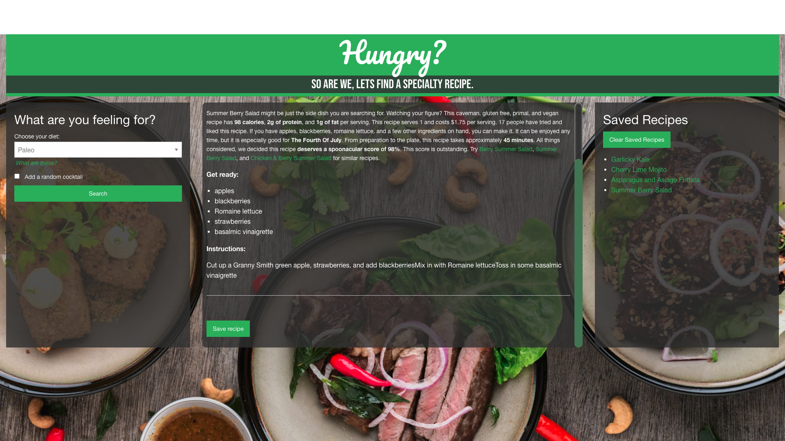

# Random Specialty Recipe Finder

Launch App: https://ksapir.github.io/recipe-finder/

## Description
This recipe finder uses a pair of databases to form an extensive library of recipes from which the app randomly selects based on a user-defined broad dietary restriction.
- Choose from Gluten Free, Ketogenic, Vegetarian, Vegan, Paleo, and more!
- Choose to include a randomly generated cocktail.

## User Interface
Practical and easy features were added to assist the user.
- Easy to use, straightforward and engaging layout. The user must interact with this app in order to get results. User chooses from speciality diet options from a drop menu and can check whether they'd like a random cocktail recipe to be added. Links,buttons and scrollbar responds to user and enhances user interaction.
- This application enables the user to save recipes, if they so chose. Saved recipes are stored to be used later until the user clears the list. Multiple recipes can be saved. The list populates as links and can be clicked for the user to be taken to the source of the recipe.
- If user desires to print the recipe, the user can right click anywhere on the page and select the print option. Only the recipe will printed as shown in the print preview window that pops up.

## Server-side APIs
This app retrieves data from two different APIs - one for food recipes and one for cocktail recipes.
- [Spoonacular API](https://spoonacular.com/food-api/docs)
- [theCocktailDB API](https://www.thecocktaildb.com/api.php)

## Web Application Preview

## Tech
- HTML5
- CSS
- Javascript

## Resources
- CSS framework: [Foundation](https://get.foundation/index.html)
- Fonts: [Google Fonts](https://fonts.google.com/)
- [Stack Overflow](https://stackoverflow.com/)
- [W3 Schools](https://www.w3schools.com/)

## Contributors
- Dru Ludwig
- Karen Pion
- Michael Lowther
- Jose Benicio
